---
# Front matter
lang: ru-RU
title: "Отчет по лабораторной работе №6"
subtitle: "Дисциплина: операционные системы"
author: "Сергеев Тимофей Сергеевич"

# Formatting
toc-title: "Содержание"
toc: true # Table of contents
toc_depth: 2
lof: true # List of figures
lot: true # List of tables
fontsize: 12pt
linestretch: 1.5
papersize: a4paper
documentclass: scrreprt
polyglossia-lang: russian
polyglossia-otherlangs: english
mainfont: PT Serif
romanfont: PT Serif
sansfont: PT Sans
monofont: PT Mono
mainfontoptions: Ligatures=TeX
romanfontoptions: Ligatures=TeX
sansfontoptions: Ligatures=TeX,Scale=MatchLowercase
monofontoptions: Scale=MatchLowercase
indent: true
pdf-engine: lualatex
header-includes:
  - \linepenalty=10 # the penalty added to the badness of each line within a paragraph (no associated penalty node) Increasing the value makes tex try to have fewer lines in the paragraph.
  - \interlinepenalty=0 # value of the penalty (node) added after each line of a paragraph.
  - \hyphenpenalty=50 # the penalty for line breaking at an automatically inserted hyphen
  - \exhyphenpenalty=50 # the penalty for line breaking at an explicit hyphen
  - \binoppenalty=700 # the penalty for breaking a line at a binary operator
  - \relpenalty=500 # the penalty for breaking a line at a relation
  - \clubpenalty=150 # extra penalty for breaking after first line of a paragraph
  - \widowpenalty=150 # extra penalty for breaking before last line of a paragraph
  - \displaywidowpenalty=50 # extra penalty for breaking before last line before a display math
  - \brokenpenalty=100 # extra penalty for page breaking after a hyphenated line
  - \predisplaypenalty=10000 # penalty for breaking before a display
  - \postdisplaypenalty=0 # penalty for breaking after a display
  - \floatingpenalty = 20000 # penalty for splitting an insertion (can only be split footnote in standard LaTeX)
  - \raggedbottom # or \flushbottom
  - \usepackage{float} # keep figures where there are in the text
  - \floatplacement{figure}{H} # keep figures where there are in the text
---

# Цель работы

Ознакомление с файловой системой Linux, её структурой, именами и содержа-
нием каталогов. Приобретение практических навыков по применению команд для
работы с файлами и каталогами, по управлению процессами (и работами), по про-
верке использования диска и обслуживанию файловой системы.

# Выполнение лабораторной работы

1. Выполним все примеры, приведённые в первой части описания лабораторной
работы.

1.1 Создание текстового файла 

{ #fig:001 width=70% }

1.2 Команда ля просмотра небольших файлов

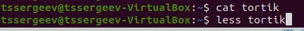{ #fig:002 width=70% }

1.3 Команда для просмотра больших файлов 

{ #fig:003 width=70% }

Для просмотра начала файла можно воспользоваться командой 
head [-n] имя-файла,
где n — количество выводимых строк.
Команда tail выводит несколько (по умолчанию 10) последних строк файла.
Формат команды:
tail [-n] имя-файла,
где n — количество выводимых строк.

{ #fig:004 width=70% }

2. Выполним следующие действия, зафиксировав в отчёте по лабораторной работе
используемые при этом команды и результаты их выполнения:

2.1. Скопируйте файл /usr/include/sys/io.h в домашний каталог и назовите
его equipment. Если файла io.h нет, то используйте любой другой файл в
каталоге /usr/include/sys/ вместо него.

{ #fig:005 width=70% }

2.2. В домашнем каталоге создайте директорию ~/ski.plases.

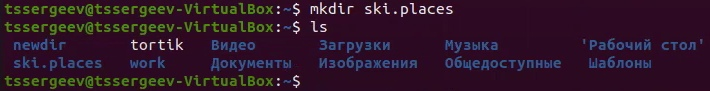{ #fig:006 width=70% }

2.3. Переместите файл equipment в каталог ~/ski.plases.

{ #fig:007 width=70% }

2.4. Переименуйте файл ~/ski.plases/equipment в
~/ski.plases/equiplist.

{ #fig:008 width=70% }

2.5. Создайте в домашнем каталоге файл abc1 и скопируйте его в каталог
~/ski.plases, назовите его equiplist2.

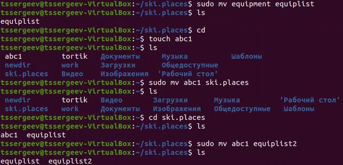{ #fig:009 width=70% }

2.6. Создайте каталог с именем equipment в каталоге ~/ski.plases.

{ #fig:010 width=70% }

2.7. Переместите файлы ~/ski.plases/equiplist и equiplist2 в каталог
~/ski.plases/equipment.

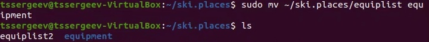{ #fig:011 width=70% }

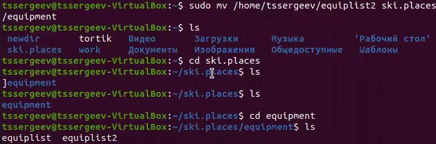{ #fig:012 width=70% }

2.8. Создайте и переместите каталог ~/newdir в каталог ~/ski.plases и назо-
вите его plans.

{ #fig:013 width=70% }

{ #fig:014 width=70% }

3. Определите опции команды chmod, необходимые для того, чтобы присвоить пе-
речисленным ниже файлам выделенные права доступа, считая, что в начале та-
ких прав нет:

Создаем два каталога (australia и olay) и два файла (my_os, feathers) (О формате понятно из кода (наличие буквы d говорит о каталоге))

3.1. drwxr--r-- ... australia

{ #fig:015 width=70% }

3.2. drwx--x--x ... play

{ #fig:016 width=70% }

3.3. -r-xr--r-- ... my_os

3.4. -rw-rw-r-- ... feathers

{ #fig:017 width=70% }

4. Проделайте приведённые ниже упражнения, записывая в отчёт по лабораторной
работе используемые при этом команды:

4.1. Просмотрите содержимое файла /etc/password.

{ #fig:018 width=70% }

4.2. Скопируйте файл ~/feathers в файл ~/file.old.

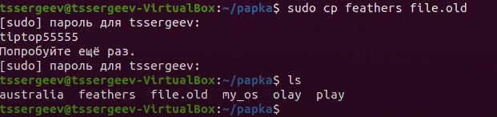{ #fig:019 width=70% }

4.3. Переместите файл ~/file.old в каталог ~/play.

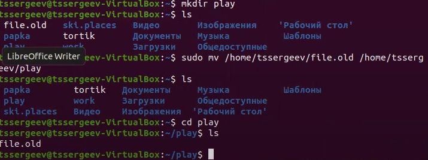{ #fig:020 width=70% }

4.4. Скопируйте каталог ~/play в каталог ~/fun.

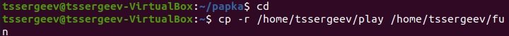{ #fig:021 width=70% }

4.5. Переместите каталог ~/fun в каталог ~/play и назовите его games.

{ #fig:022 width=70% }

4.6. Лишите владельца файла ~/feathers права на чтение.

{ #fig:023 width=70% }

4.7. Что произойдёт, если вы попытаетесь просмотреть файл ~/feathers ко-
мандой cat?

Будет отказано в доступе.

{ #fig:024 width=70% }

4.8. Что произойдёт, если вы попытаетесь скопировать файл ~/feathers?

Будет отказано в доступе.

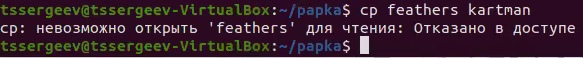{ #fig:025 width=70% }

4.9. Дайте владельцу файла ~/feathers право на чтение.

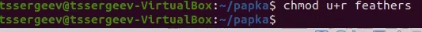{ #fig:026 width=70% }

4.10. Лишите владельца каталога ~/play права на выполнение.

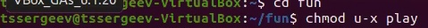{ #fig:027 width=70% }

4.11. Перейдите в каталог ~/play. Что произошло?

Нам отказали в доступе.

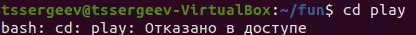{ #fig:028 width=70% }

4.12. Дайте владельцу каталога ~/play право на выполнение.

{ #fig:029 width=70% }

5. Прочитайте man по командам mount, fsck, mkfs, kill и кратко их охарактери-
зуйте, приведя примеры.

{ #fig:030 width=70% }

Команда mount - используется для подключения (монтирования) файловых систем и переносных накопителей (например, USB-флешек) к конкретным точкам монтирования в дереве директорий.

Пример:

{ #fig:031 width=70% }

___

{ #fig:032 width=70% }

fsck (проверка файловой системы) - это утилита командной строки, которая позволяет выполнять проверки согласованности и интерактивное исправление в одной или нескольких файловых системах Linux.

___

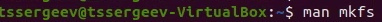{ #fig:033 width=70% }

Создать файловую систему linux, семейства ext, на устройстве можно с помощью команды mkfs.

Пример:

{ #fig:034 width=70% }

___

{ #fig:035 width=70% }

Когда известен PID процесса, мы можем убить его командой kill. Команда kill принимает в качестве параметра PID процесса.

Пример:

{ #fig:036 width=70% }

# Выводы

После выполнения поставленных задач я ознакомился с файловой системой Linux, её структурой, именами и содержанием каталогов, приобрел практические навыкы по применению команд для работы с файлами и каталогами, по управлению процессами (и работами), по про-
верке использования диска и обслуживанию файловой системы.
